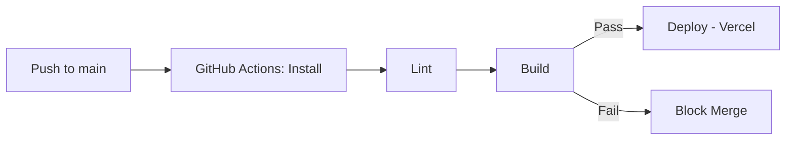

<div align="center">


[](https://the-vivek-sharma.vercel.app)

[](https://the-vivek-sharma.vercel.app)
[](https://the-vivek-sharma.vercel.app/github)
[](https://drive.google.com/file/d/1DMyYJ43lSILc8FyrjmqrmKbQabmenq-t/view?usp=sharing)
[](mailto:viveksupmanyu@gmail.com)

🟢 **Open to work** &nbsp;·&nbsp; 📍 Bangalore, India &nbsp;·&nbsp; 3+ yrs experience

</div>

---

```typescript
interface Engineer {
  readonly name: string;
  readonly role: string;
  readonly experience: string;
  readonly stack: string[];
}

class VivekSharma implements Engineer {
  readonly name = "Vivek Sharma";
  readonly role = "Frontend / Full-Stack Engineer";
  readonly experience = "3+ years";
  readonly stack = ["React", "Next.js", "TypeScript", "Node.js"];

  readonly impact: string[] = [
    "Raised Lighthouse performance scores ~20% and cut unnecessary re-renders ~40%",
    "Restructured a reporting dashboard around custom hooks, cutting generation latency ~30%",
    "Hardened OAuth/JWT auth flows and fixed cross-browser edge cases, reducing bug reports ~25%",
    "Owns the full loop: component architecture, API contracts, performance, and release",
  ];

  readonly currentlyBuilding = "A live, API-driven portfolio — see it below";
}
```

---

<div align="center">

### 🌐 Portfolio & Live GitHub Activity

**[the-vivek-sharma.vercel.app](https://the-vivek-sharma.vercel.app)** — case studies, blog, and a dedicated **[GitHub Activity page](https://the-vivek-sharma.vercel.app/github)** with real-time stats, contribution streaks, and top repos pulled live from the GitHub API — no static badge images to go stale.

</div>

---

## 🧑‍💻 Tech Stack

### Languages & Core Runtime
 &nbsp;  &nbsp;  &nbsp;  &nbsp; 

---

### Frontend & State
 &nbsp;  &nbsp;  &nbsp;  &nbsp; 

---

### UI & Design
 &nbsp;  &nbsp; 

---

### Data & Distributed Services
 &nbsp;  &nbsp;  &nbsp;  &nbsp; 

---

### Quality & Deployment
 &nbsp;  &nbsp;  &nbsp;  &nbsp;  &nbsp;  &nbsp;  &nbsp;  &nbsp;  &nbsp;  &nbsp; 

---

<details>
<summary><b>Also comfortable with</b> — secondary stack &amp; libraries without a dedicated icon</summary>
<br>

 &nbsp;  &nbsp;  &nbsp; 

`React Query` `React Router` `Framer Motion` `React Native` `WebSocket` `OAuth 2.0 / JWT` `BullMQ` `Serverless (Vercel)` `OpenAI API` `React Testing Library` `SonarQube`

</details>

---

## 🌱 Featured Projects

<table width="100%">
<tr>
<td width="50%" valign="top">

### 🛍️ Shop-Now
Accessible eCommerce site with speech-to-text browsing and shopping for differently-abled users.

`HTML` `CSS` `JavaScript`

[🔗 Live Demo](https://slv-webtech.github.io/Shop-Now/) &nbsp;·&nbsp; [📦 Repository](https://github.com/Slv-WebTech/Shop-Now)

</td>
<td width="50%" valign="top">

### 🏢 Business-Consultancy
Consultancy site connecting clients with expert services, built with React and a third-party API integration.

`React`

[🔗 Live Demo](https://slv-webtech.github.io/Business-Consultancy/) &nbsp;·&nbsp; [📦 Repository](https://github.com/Slv-WebTech/Business-Consultancy)

</td>
</tr>
<tr>
<td width="50%" valign="top">

### 🏥 Medi-Gwalior
RGPV Hackathon project — hospital website helping COVID-19 patients find medical resources.

`HTML` `CSS` `JavaScript` `PHP`

[🔗 Live Demo](https://slv-webtech.github.io/Medi-Gwalior/) &nbsp;·&nbsp; [📦 Repository](https://github.com/Slv-WebTech/Medi-Gwalior)

</td>
<td width="50%" valign="top">

### 🏨 Swarn-Project
Hotel management site with a responsive room browser and reservation flow.

`HTML` `CSS` `JavaScript`

[🔗 Live Demo](https://slv-webtech.github.io/Swarn-Project/) &nbsp;·&nbsp; [📦 Repository](https://github.com/Slv-WebTech/Swarn-Project)

</td>
</tr>
<tr>
<td width="50%" valign="top">

### 🐾 Hum-Hai-Na
Single-page site for an animal welfare NGO.

`HTML` `CSS` `JavaScript`

[🔗 Live Demo](https://slv-webtech.github.io/Hum-Hai-Na/) &nbsp;·&nbsp; [📦 Repository](https://github.com/Slv-WebTech/Hum-Hai-Na)

</td>
<td width="50%" valign="top">

### 📦 inventory-management
Stock, order, and reporting app for inventory operations.

`Python`

[📦 Repository](https://github.com/Slv-WebTech/inventory-management)

</td>
</tr>
</table>

For live star/fork counts, see the [GitHub Activity page](https://the-vivek-sharma.vercel.app/github) — badge-card services here kept going down, so this profile links to real data instead of embedding more of them.

---

## ⚙️ CI/CD Flow



---

## 📊 GitHub Stats

<div align="center">


**Full contribution calendar, current/longest streaks, top languages, and recent activity — live, not a cached image:**
**[the-vivek-sharma.vercel.app/github](https://the-vivek-sharma.vercel.app/github)**

</div>

---

## 🤝 Connect with Me

<div align="center">

[](https://www.linkedin.com/in/viveksharma5u/)
[](https://twitter.com/viveksh76483611/)
[](https://dev.to/viveksh76483611)
[](https://www.instagram.com/the_r.r_upmanyu_ji.s_son/)

</div>

---

## 💡 Let's Collaborate

I'm always open to discussing new projects, innovative ideas, and opportunities to learn and grow. Don't hesitate to get in touch!

<div align="center">


</div>

---

<div align="center">


</div>
